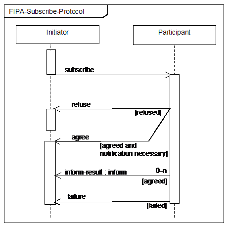
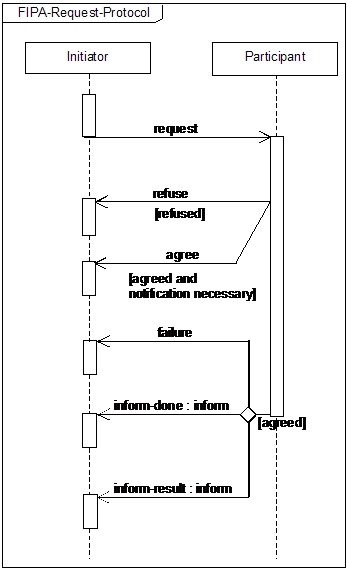

# AIAD
Repository for the code developed for the course AIAD at FEUP.

## Info
 * **Date** : 4th year, 1st Semester, 2020/2021
 * **Course** : [Agentes e Inteligência Artificial Distribuída](https://sigarra.up.pt/feup/pt/ucurr_geral.ficha_uc_view?pv_ocorrencia_id=459491) | [Agents and Distributed Artificial Intelligence](https://sigarra.up.pt/feup/en/UCURR_GERAL.FICHA_UC_VIEW?pv_ocorrencia_id=459491)
 * **Contributors** : [Bernardo Moreira](https://github.com/BernardoCMoreira), [Bernardo Santos](https://github.com/bernas670), [João Matos](https://github.com/joaonmatos)

## Table of Contents
 * **1st Project** : [Agent based Airport Traffic Control](#agent-based-airport-traffic-control)

## Agent based Airport Traffic Control

A simple simulation of an airport's infrastructure, focused on the control tower's job. Takes into account the capacity of the airport and the condition of the runways.

 * [Agents](#agents)
   * [Control Tower](#control-tower)
   * [Runway Maintenance](#runway-maintenance)
   * [Arriving Plane](#arriving-plane)
   * [Departing Plane](#departing-plane)
 * [Variables](#variables)
   * [Independent Variables](#independent-variables)
   * [Dependent Variables](#dependent-variables)
 * [Objectives](#objectives)
 * [Strategies](#strategies)
   * [Greedy](#greedy)
   * [Incremental Scheduling](#incremental-scheduling)
 * [Protocols](#protocols)
   * [Control Tower- Runway Maintenance](#control-tower---runway-maintenance)
   * [Arriving and Departing Planes - Control Tower](#arriving-and-departing-planes---control-tower)

### Agents
#### Control Tower
This agent is responsible for scheduling take offs and landing of the planes, always trying to maximize one of the optimization criteria, while keeping the each runway’s restrictions and not going above the airport’s capacity. The control tower receives requests to land or depart and updates from the runway’s conditions in real time, and, because of that, the scheduling is done dynamically.
#### Runway Maintenance
During normal operation, especially if takeoffs and landings take place, there is a probability of debris appearing on a runway. At that time, that strip’s maintenance team will decide to close it for an interval of time, informing the air controller, who must reallocate the affected operations.
#### Arriving Plane
When getting near the airport, an airplane, which has a maximum waiting time, requests a landing authorization from air control. If it gets a positive response, it will wait around until that time slot and then perform the landing. If the waiting time is out, if it gets a negative response or if it decides to cancel the request, it will ‘disappear’ (looking for another airport).
#### Departing Plane
After deciding that it is ready for takeoff, the airplane requests from air control a slot for takeoff (time and runway). If the response is positive, it will prepare for it and execute it. If not, it will try again later.

### Variables
#### Independent Variables
 * Number of runways
 * Number of planes
 * Time spent by planes on the runway
 * Airport capacity
#### Dependent Variables
 * Number of arrivals
 * Number of departures
 * Number of redirected planes
 * Wait time for landings
 * Wait time for takeoffs

### Objectives
 * Maximize the number of arrivals and departures
 * Minimize the wait times, minimizing the cost of operation
 * Minimize the number of redirected planes

### Strategies
#### Greedy
This strategy aims to achieve the mentioned objectives by making the best possible choice at each moment without taking into consideration the later effects of that decision. For example, if the control tower receives a request from a departing plane and right after one from an arriving plane that is running low on fuel and only one runway is ready for use, it will authorize the first plane to takeoff and redirect the second one to another airport.
#### Incremental Scheduling

### Protocols
#### Control Tower - Runway Maintenance

#### Arriving and Departing Planes - Control Tower

